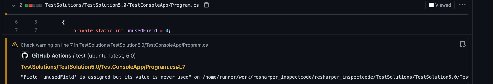

[](https://github.com/muno92/resharper_inspectcode/actions/workflows/test.yml)

# ReSharper CLI InspectCode

This action inspect code with ReSharper Command Line Tool.

Inspection result is annotate to PR File Change Tab.



## Input

### solutionPath

**Required**

Path to Solution file to be inspected.

### failOnIssue

Whether the action should fail if there are any issues. Default is `'1'`.

Set this option to `'0'` prevent the action from failing when issues exist (annotations will still be present).

### version

Version of the Resharper CLI tool to install. Defaults to the latest available.

### minimumReportSeverity

- INFO
- HINT (default)
- SUGGESTION
- WARNING
- ERROR

Minimum severity for issues to be reported. Defaults to "HINT".

### minimumSeverity

- error
- warning
- notice (default)

Minimum severity for issues to cause the action to fail. Defaults to "notice". Ignored if `failOnIssue` is set to `'0'`.

### exclude

Relative path(s) or file masks that define which files to exclude during the inspection.

More info: https://www.jetbrains.com/help/resharper/InspectCode.html#inspection-parameters

### include

Include one or more paths or file masks; see [the documentation][include-arg]. Specify one path or
pattern per line.

Example:

```yml
- name: Inspect code
  uses: muno92/resharper_inspectcode@v1
  with:
    solutionPath: ./YourSolution.sln
    include: |
      **.cs
      **.cshtml
```

[include-arg]: https://www.jetbrains.com/help/resharper/InspectCode.html#inspection-parameters

### ignoreIssueType

Comma-separated or line-separated list of issue types to ignore.

Example:

```text
UnusedField.Compiler,UnusedMember.Global
```

```yml
- name: Inspect code
  uses: muno92/resharper_inspectcode@v1
  with:
    solutionPath: ./YourSolution.sln
    ignoreIssueType: |
      UnusedField.Compiler
      UnusedMember.Global
```

Issue Types reference: https://www.jetbrains.com/help/resharper/Reference__Code_Inspections_CSHARP.html

### solutionWideAnalysis

- true
- false

Explicitly enable or disable solution-wide analysis. If not specified, solution-wide analysis will
be enabled or disabled based on the existing settings.

### extensions

Comma-separated list of extensions to install.

Example:

```text
StyleCop.StyleCop,ReSharperPlugin.CognitiveComplexity
```

### workingDirectory

The directory to run the command in. All paths (solution path, include/exclude patterns, etc) are
also relative to this directory.

### noBuild

- true
- false (default)

et you specify whether to build the target solution before starting the analysis.  
By default, InspectCode always builds the solution.

More info: https://www.jetbrains.com/help/resharper/InspectCode.html#inspection-parameters

### cachesHome

Lets you specify a custom location for the data that InspectCode caches.

More info: https://www.jetbrains.com/help/resharper/InspectCode.html#inspection-parameters

### verbosity
This parameter lets you control the level of detail in InspectCode's output.

More info: https://www.jetbrains.com/help/resharper/InspectCode.html#auxiliary-parameters

### properties

Lets you override MSBuild properties.  
You can use a semicolon to separate multiple properties `--properties:prop1=val1;prop2=val2`.

Example:

```text
Platform=x64;Configuration=Debug
```

### dotnetVersion

Lets you specify the version of the .NET SDK to use.
(Default is the latest version).

## Usage

```yaml
on: [push]

jobs:
  inspection:
    runs-on: ubuntu-latest # or macos-latest, windows-latest
    name: Inspection
    steps:
      - name: Checkout
        uses: actions/checkout@v4
      - name: Setup .NET
        id: setup-dotnet
        uses: actions/setup-dotnet@v3
        with:
          dotnet-version: '8.0.x' # [3.1.x, 5.0.x, 6.0.x, 7.0.x, 8.0.x]
      - name: Restore
        run: dotnet restore
      - name: Inspect code
        uses: muno92/resharper_inspectcode@v1
        with:
          solutionPath: ./YourSolution.sln
          dotnetVersion: ${{ steps.setup-dotnet.outputs.dotnet-version }}
```
